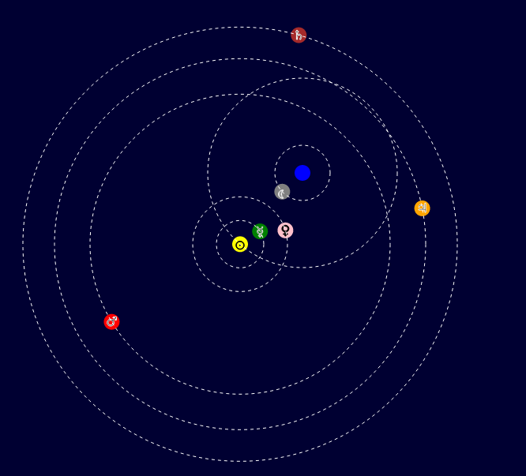

# Astro Clock Simulation

This simulates the motions of the planets if the earth was thought of being at the center of the solar system.

The animation SVG based and the planets always start in the same position, so while the movements are accurate to a degree, the actual positions are not. It's merely to show how the movements work in a "geocentric" model.

# Building and Running

This uses yarn and npm, and bundles javascript using Parcel.

This was made using node version `v20.13.1` and npm `10.5.2`.

Node and npm were installed using nvm, from https://nodejs.org/en/download/package-manager.

Packages are managed using yarn version `1.22.22`.

After cloning the repository, run `yarn install`.

To run the local server, run `yarn parcel src/index.html` and the page should be running at `localhost:1234`.

